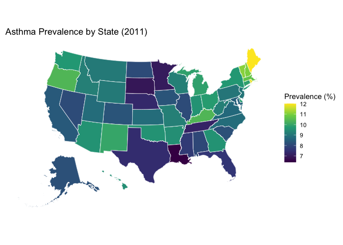
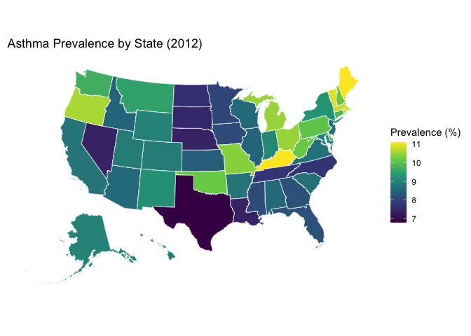
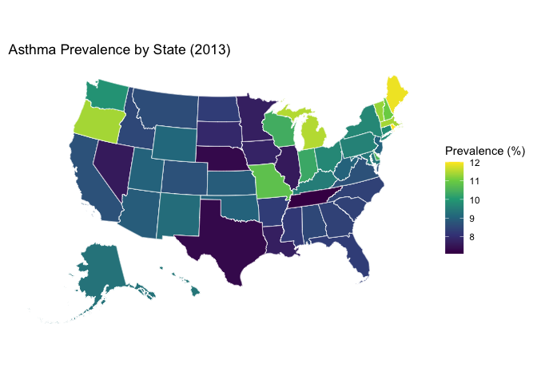

mapping
================
Kimberly Lopez
2024-12-03

``` r
library(tidyverse)
library(tigris)
library(sf)
library(usmap) # May need to install.packages to run this 
library(ggplot2)
library(dplyr)
```

Downloading state shape file Data

``` r
shape_files = usmap::us_map()
asthma_df = read_csv("data/asthma_data.csv")|>
  mutate(year= year_name)
```

    ## Rows: 559 Columns: 3
    ## ── Column specification ────────────────────────────────────────────────────────
    ## Delimiter: ","
    ## chr (1): state
    ## dbl (2): year_name, prevalence_percent
    ## 
    ## ℹ Use `spec()` to retrieve the full column specification for this data.
    ## ℹ Specify the column types or set `show_col_types = FALSE` to quiet this message.

``` r
weather_df = read_csv("data/temp_data.csv")
```

    ## Rows: 2193 Columns: 4
    ## ── Column specification ────────────────────────────────────────────────────────
    ## Delimiter: ","
    ## chr (2): state, season
    ## dbl (2): year, avg_temp
    ## 
    ## ℹ Use `spec()` to retrieve the full column specification for this data.
    ## ℹ Specify the column types or set `show_col_types = FALSE` to quiet this message.

Merging Asthma & temp & shapefile data

``` r
asthma_weather = 
  asthma_df |>
  left_join(weather_df, by = c("state", "year")) 


final_df =
  shape_files |>
  mutate(state = abbr) |>                           
  left_join(asthma_weather, by = "state") |>        
  drop_na()                                         
```

Mapping Prevalence data by state:

``` r
final_df|> 
  filter(year==2011)|> 
  ggplot() +
  geom_sf(aes(fill = prevalence_percent), color = "white") +
  scale_fill_viridis_c(na.value = "grey90") + 
  theme_minimal() +
  labs(
    title = "Asthma Prevalence by State (2011)",
    fill = "Prevalence (%)"
  ) +
  theme(
    panel.grid = element_blank(), 
    axis.text = element_blank(),
    axis.title = element_blank(),
    axis.ticks = element_blank()
  )
```

<!-- -->

``` r
final_df|> 
  filter(year==2012)|>
  ggplot() +
  geom_sf(aes(fill = prevalence_percent), color = "white") +
  scale_fill_viridis_c(na.value = "grey90") + 
  theme_minimal() +
  labs(
    title = "Asthma Prevalence by State (2012)",
    fill = "Prevalence (%)"
  ) +
  theme(
    panel.grid = element_blank(), 
    axis.text = element_blank(),
    axis.title = element_blank(),
    axis.ticks = element_blank()
  )
```

<!-- -->

``` r
final_df|> 
  filter(year==2013)|>
  ggplot() +
  geom_sf(aes(fill = prevalence_percent), color = "white") +
  scale_fill_viridis_c(na.value = "grey90") + 
  theme_minimal() +
  labs(
    title = "Asthma Prevalence by State (2013)",
    fill = "Prevalence (%)"
  ) +
  theme(
    panel.grid = element_blank(), 
    axis.text = element_blank(),
    axis.title = element_blank(),
    axis.ticks = element_blank()
  )
```

<!-- -->

Do regions with higher asthma prevalence overlap with areas of lower
average temperature?

Does analyzing prevalence data stratified by time and temperature make a
difference?

- could stratify by creating temperature categories
- could then conduct if prevalence differs across tempatures categories
